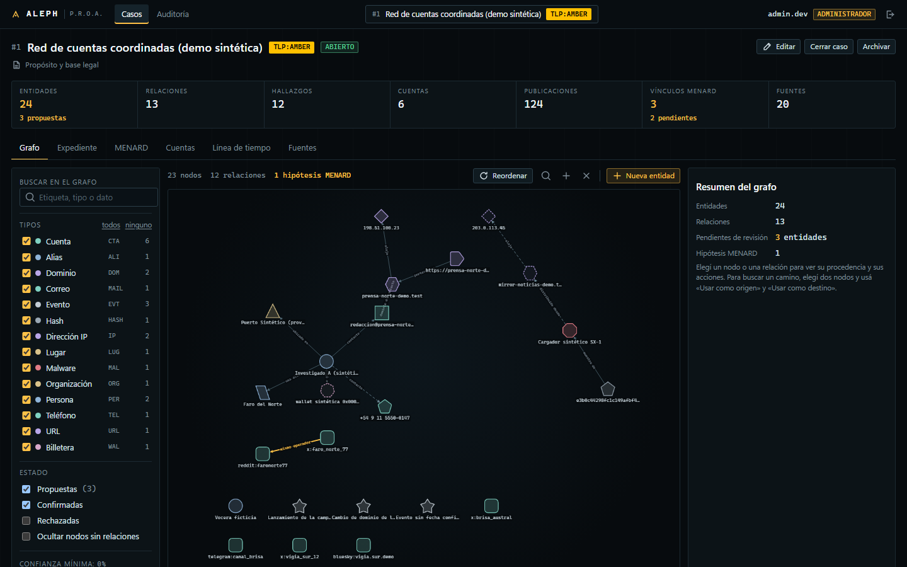
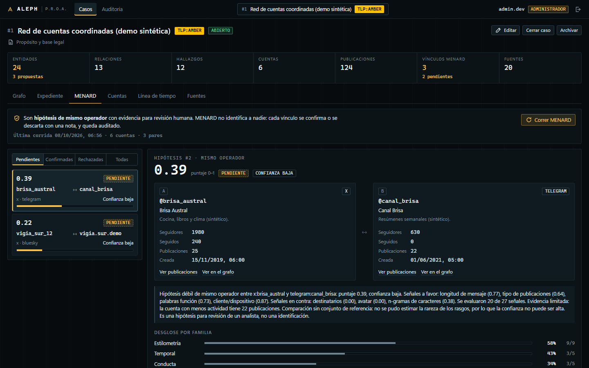

# Aleph

**Plataforma soberana de OSINT y ciberinteligencia (CTI).**
Investigación en fuentes abiertas con grafo de entidades, IA 100 % local, atribución de cuentas por estilometría y trazabilidad completa de cada dato y cada acción.

> Estado: **en desarrollo activo** (octubre 2026). Los motores y la consola web están implementados y probados; el despliegue y la validación contra plataformas reales están en curso. La sección [Estado y verificación](#estado-y-verificación) dice exactamente qué está probado y qué no.

Producto: **P.R.O.A.** (Plataforma de Reconocimiento y Operaciones Analíticas).
Proyecto de Prácticas Profesionalizantes, 6.º año de Informática.



*Caso de demostración con datos 100 % sintéticos.*

---

## Por qué existe

Los equipos de análisis dependen de herramientas propietarias extranjeras o de servicios en la nube para tratar información sensible. Aleph explora la alternativa: una plataforma que corre entera en infraestructura propia, habla los estándares del rubro y deja registro verificable de todo lo que hace un operador.

Tres principios de diseño:

1. **Soberanía.** Ningún dato sale de la red propia. El cliente de IA rechaza cualquier dirección que no sea interna.
2. **Trazabilidad.** Todo dato tiene procedencia (fuente, fecha, hash del crudo, fiabilidad según Admiralty Code). Toda acción queda en una auditoría encadenada por hash.
3. **Hipótesis, no veredictos.** Lo que proponen los motores queda pendiente hasta que un analista lo confirma o lo descarta, y esa decisión también se audita.

## Módulos

| Módulo | Qué hace |
|---|---|
| **Núcleo** | Casos con base legal obligatoria y marca TLP, grafo de entidades y relaciones, expediente por incisos, roles (admin, analista, auditor), auditoría inmutable |
| **MENARD** | Detección de posibles multicuentas: estilometría, patrones horarios, conducta, red y perfil, fusionados en un puntaje calibrado con evidencia legible |
| **FUNES** | IA local: extracción de entidades (reglas para documentos argentinos + LLM), motor de contradicciones espacio-temporales, borrador de informe, mapeo a ATT&CK |
| **CTI** | Extracción y enriquecimiento de IOCs, exportación e importación STIX 2.1, eventos MISP, capas para ATT&CK Navigator, TLP 2.0 |
| **Conectores** | Bluesky, Mastodon, Reddit, GitHub, Telegram (canales públicos), X (API oficial); importación de archivos oficiales de X, Instagram y Discord |
| **Caja OSINT** | Metadatos de imágenes y documentos, Wayback Machine, dorks, typosquatting, favicon hash, ASN, wallets, CVE/KEV, ransomware, preservación de evidencia |
| **Aleph Lens** | Extensión de navegador: mientras el analista navega, resalta datos relevantes en la página y permite arrastrarlos al expediente del caso |

Los nombres vienen de Borges: *El Aleph* (el punto que contiene todos los puntos), *Funes el memorioso* (el que no olvida ningún detalle) y *Pierre Menard, autor del Quijote* (mismo texto, ¿mismo autor?).

## MENARD: atribución de cuentas

Compara cuentas de a pares, también entre plataformas distintas, usando señales independientes:

- **Estilometría**: n-gramas de caracteres, palabras función, puntuación, mayúsculas, alargamientos, emojis, errores ortográficos recurrentes, marcas rioplatenses.
- **Temporal**: actividad por hora y día, ventana de sueño, huso inferido, alternancia.
- **Conducta**: cliente, hashtags, dominios compartidos, destinatarios de respuestas.
- **Red**: solapamiento de seguidos y seguidores ponderado por rareza.
- **Perfil**: similitud de nombre de usuario y bio, fecha de creación, hash perceptual del avatar.

Cada señal informa su puntaje, su explicación y ejemplos concretos. Si no hay datos suficientes se declara no disponible en lugar de inventar un valor.

### Evaluación

Sobre un dataset **sintético** propio (4 mundos de prueba, 990 cuentas, 122 064 pares, 0,48 % positivos; ninguna persona de prueba aparece en entrenamiento):

| Métrica | Valor |
|---|---|
| AUC-ROC | 0,987 |
| EER | 0,058 |
| Precisión a umbral 0,5 | 0,873 |
| Recall a umbral 0,5 | 0,597 |
| AUC entre plataformas distintas | 0,984 |
| AUC cuando una cuenta disimula su estilo | 0,957 (recall 0,115) |



**Estos números son un techo optimista.** El texto sintético sale de plantillas y es más regular que el de personas reales, y entrenamiento y prueba comparten el proceso generador. Todavía no hay evaluación con datos reales; el cargador para datasets públicos de verificación de autoría (formato PAN) está preparado para eso. El detalle completo, incluidos los casos donde el motor falla, está en [`backend/aleph/menard/EVALUATION.md`](backend/aleph/menard/EVALUATION.md).

## Límites que el proyecto respeta

- Solo datos públicos, APIs oficiales o exportaciones que aporta el operador.
- Sin evasión de controles de plataformas, sin resolución de CAPTCHAs, sin uso de credenciales de terceros.
- Aleph Lens es pasiva: lee lo que el analista ya tiene en pantalla; no navega, no hace scroll ni clics por su cuenta, y excluye mensajes privados.
- Todo caso exige propósito y base legal (Ley 25.326 de Protección de Datos Personales).
- Las pruebas y demostraciones usan datos sintéticos, no personas reales.

## Arquitectura

```
backend/aleph/
  core/        modelo de datos, esquemas compartidos, auditoría encadenada
  api/         FastAPI: auth, casos, grafo, expediente, MENARD, auditoría
  menard/      detección de multicuentas + generador sintético + evaluador
  funes/       IA local
  cti/         IOCs, STIX 2.1, MISP, ATT&CK, TLP
  connectors/  recolección
  osint/       caja de herramientas
extension/     Aleph Lens (Manifest V3, sin framework)
frontend/      consola web (React + TypeScript + Cytoscape.js)
docs/          plan maestro y contrato OpenAPI
```

Stack: Python 3.12, FastAPI, SQLAlchemy 2, PostgreSQL (SQLite en desarrollo), scikit-learn, NumPy, React, TypeScript, Cytoscape.js. La IA usa cualquier servidor compatible con la API de OpenAI dentro de la red propia (llama.cpp, LiteLLM).

Los motores no tocan la base de datos: reciben y devuelven esquemas tipados, y por eso se prueban sin red, sin GPU y sin servicios externos.

## Estado y verificación

| Componente | Tests | Verificado contra el mundo real |
|---|---|---|
| Núcleo y API | pasan | Sí, sobre SQLite. PostgreSQL pendiente |
| Auditoría encadenada | pasan, incluida escritura concurrente | Sí |
| MENARD | pasan | Solo dataset sintético |
| FUNES | pasan | Reglas: sí. LLM: solo con respuestas simuladas |
| CTI | pasan | STIX validado con la librería `stix2`. Proveedores externos: solo simulados |
| Conectores | pasan | GitHub parcial. El resto contra ejemplos escritos a mano |
| Caja OSINT | pasan | Algoritmos verificados con vectores conocidos. APIs: solo simuladas |
| Aleph Lens | pasan | Extractores contra HTML de ejemplo, no contra las páginas reales |
| Consola web | build sin errores | Recorrida en navegador contra la API real; sin tests unitarios |

Total: 849 tests de backend (incluido un recorrido de punta a punta sobre el caso de demostración) y 106 de la extensión.

## Cómo correrlo

```bash
python -m venv .venv
.venv/Scripts/python -m pip install -e "backend[dev]"
.venv/Scripts/python -m pytest backend/tests -q
```

```bash
cd backend && ../.venv/Scripts/python -m aleph.menard.eval --write-md
```

### Demo con datos sintéticos

```powershell
powershell -ExecutionPolicy Bypass -File .\scripts\dev.ps1
```

Crea una base local, siembra un caso ficticio de phishing (33 cuentas, 1 487 publicaciones, 23 hipótesis de MENARD, una contradicción espacio-temporal, técnicas ATT&CK) y levanta la API en `http://127.0.0.1:8100/docs`. Las credenciales de demo se generan e imprimen al final. Después, `npm install && npm run dev` en `frontend/`.

La configuración va por variables `ALEPH_*`; ver [`.env.example`](.env.example).

## Hoja de ruta

- Evaluación de MENARD con datasets públicos de verificación de autoría.
- Embeddings de estilo en GPU como señal adicional.
- Validación de conectores y de Aleph Lens contra las plataformas reales.
- Despliegue con Docker Compose.

## Equipo

Proyecto de un equipo de cinco estudiantes de Prácticas Profesionalizantes.
Dirección técnica y arquitectura: Fabrizio Pianarosa.

Desarrollado con asistencia de herramientas de IA bajo dirección y revisión humana: la arquitectura, los contratos entre módulos, los límites del producto y la verificación de cada entrega son decisiones del equipo.

Datos de MITRE ATT&CK® sujetos a sus términos de uso.
